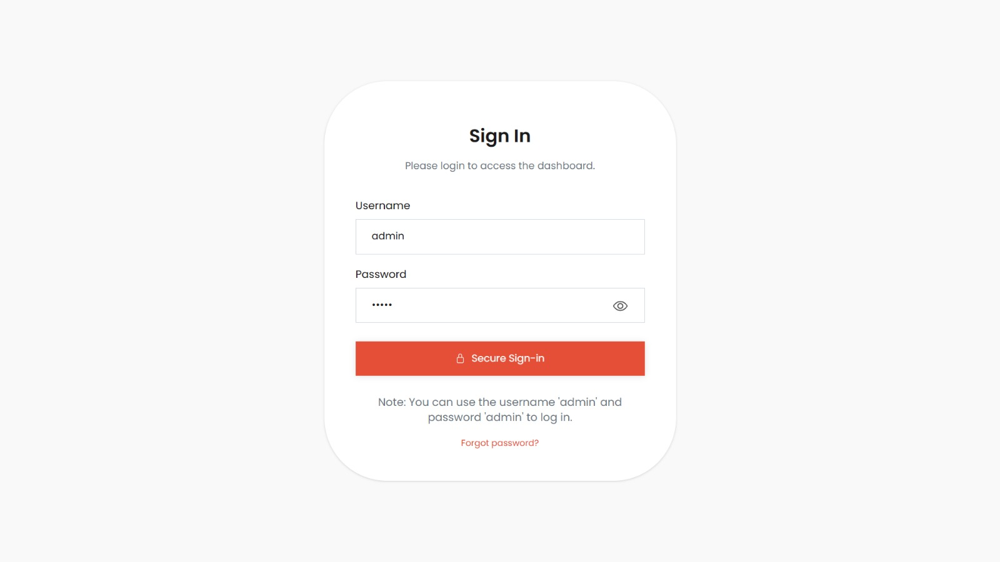
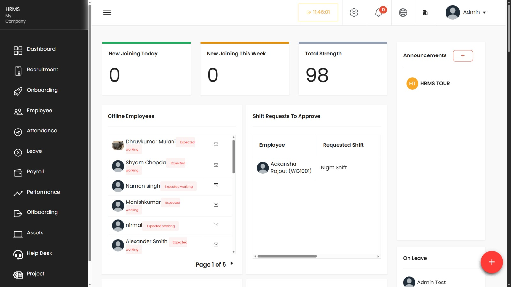
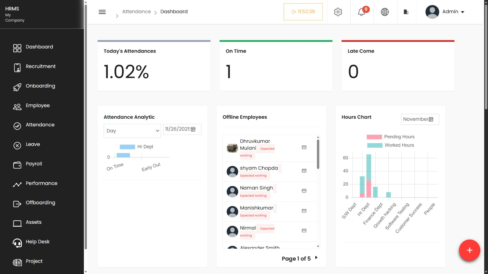
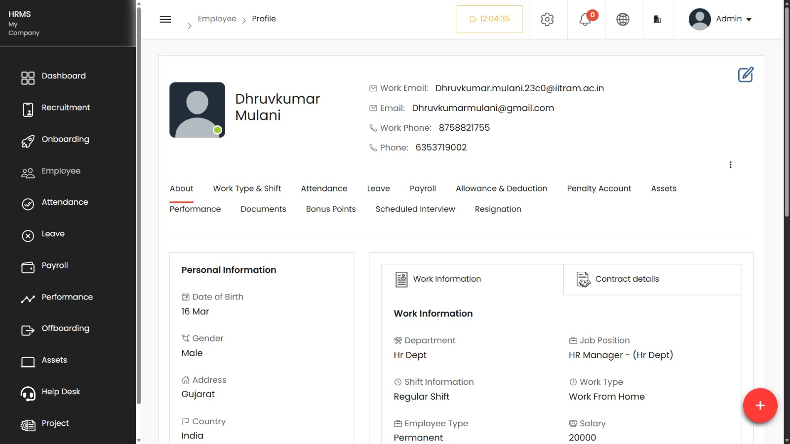

# Human Resource Management System (HRMS)
*A scalable, secure, and cloud-driven HR automation platform*

---

## 📚 Table of Contents
1. Introduction  
2. Project Objectives  
3. Problem Statement  
4. Stakeholders & Use Cases  
5. Project Scope  
6. System Features (Modules)  
7. Technology Stack  
8. System Architecture  
9. Security Model  
10. Process & Architectural Views  
11. Effort Estimation (COCOMO)  
12. Team Members  
13. Future Enhancements  
14. Acknowledgment  

---

## 📘 Introduction
The Human Resource Management System (HRMS) is a unified platform designed to automate and optimize HR processes. It eliminates manual work, reduces paperwork, and provides real-time HR insights using a secure, scalable architecture.

---

## 🎯 Project Objectives
- Reduce manual errors and paperwork  
- Improve efficiency in HR operations  
- Provide real-time insights to HR, employees, and leadership  
- Enable employee self-service  
- Ensure compliance with audit requirements  
- Build a secure and scalable architecture  

---

## ❗ Problem Statement
Traditional HR systems struggle due to:
- Dependence on spreadsheets and outdated tools  
- Manual processing of attendance, leave, payroll & recruitment  
- Lack of real-time visibility and self-service  
- Risks of data inconsistency and security breaches  

HRMS solves these problems with automation and centralized control.

---

## 👥 Stakeholders & Use Cases
| Stakeholder | Needs |
|------------|--------|
| **HR/Admin** | Payroll automation, centralized data, reporting |
| **Employees** | Leave requests, attendance, payslips |
| **Managers** | Team performance, approvals |
| **Leadership** | Compliance, analytics dashboards |

---

## 📦 Project Scope
The HRMS includes:
- Six core automation modules  
- Cloud-based architecture  
- Role-based access system  
- Secure document handling  
- Real-time & scalable design  

---

## 🧩 System Features (Modules)

### **1. Employee Management**
- Centralized employee profiles  
- Document management  
- Personal & job-related details  

### **2. Attendance Management**
- Timestamped check-in/out  
- Daily/monthly reporting  
- Manager view of team attendance  

### **3. Leave Management**
- Leave requests  
- Balance validation  
- Multi-level approval workflow  

### **4. Payroll Processing**
- Automated salary calculations  
- Allowance & deduction handling  
- Payslip generation  

### **5. Recruitment Module**
- Candidate pipeline  
- Application tracking  
- Screening → Interview → Selection stages  

### **6. Performance Management**
- KRA-based evaluation  
- 360-degree feedback  
- Performance cycles  

---

## 🛠️ Technology Stack

### **Frontend**
- React.js  
- PWA support  

### **Backend**
- Node.js  
- Cloud Functions  

### **Database**
- PostgreSQL  
- Redis Cache  

### **Authentication**
- JWT-based authentication  
- Optional TOTP-based 2FA  

### **Storage**
- Google Cloud Storage (secure signed URLs)  

### **Hosting**
- Google Cloud Platform  

### **Real-Time Services**
- WebSockets / SSE  

---

## 🏗️ System Architecture

### **Hybrid CAP Theorem Approach**

| Module | Choice | Reason |
|--------|--------|--------|
| Payroll & Salary | CP | 100% accuracy & no double payments |
| Employee Core Data | CP | Legal compliance |
| Leave & Attendance Views | AP | Real-time consistency not critical |
| Announcements/Search | AP | High availability |

---

## 🔐 Security Model
### **Role-Based Access Control (RBAC)**
- **Admin/HR:** Full system access  
- **Manager:** Team-level access  
- **Employee:** Self-service  

### **Additional Security**
- Optional 2FA  
- Signed URLs for sensitive files  
- Audit logs for critical actions  

---

## 📊 Process & Architectural Views
The system is documented using:
- **Logical View**  
- **Development View**  
- **Physical Deployment View**  
- **Process Workflow View**  

---

## 📈 Effort Estimation (COCOMO)
- **Team Size:** 3 developers  
- **Timeline:** 8 weeks  
- **Productivity:** ~250 LOC per person per week  
- **Total:** ~6000 LOC (6 KLOC)  

Effort calculated using the **COCOMO estimation model**.

---

## 🧑‍💻 Team Members
- Dhruvkumar Mulani – 231040011006  
- Naman Singh – 231040012009  
- Shyam Chopda – 231040011028  

---
ppt : %20FINAL%20(1).pptx)

## Presentation Video :  
---

## 🚀 Future Enhancements
- Mobile App (Android/iOS)  
- AI-based resume screening  
- Biometric attendance  
- Payroll banking integrations  
- HR chatbot  
- Predictive analytics  

---
## 🖼️ UI/UX Screens

---

## 🙏 Acknowledgment
This project documentation is based on the HRMS presentation prepared by the project team.

ppt : %20FINAL%20(1).pptx)

